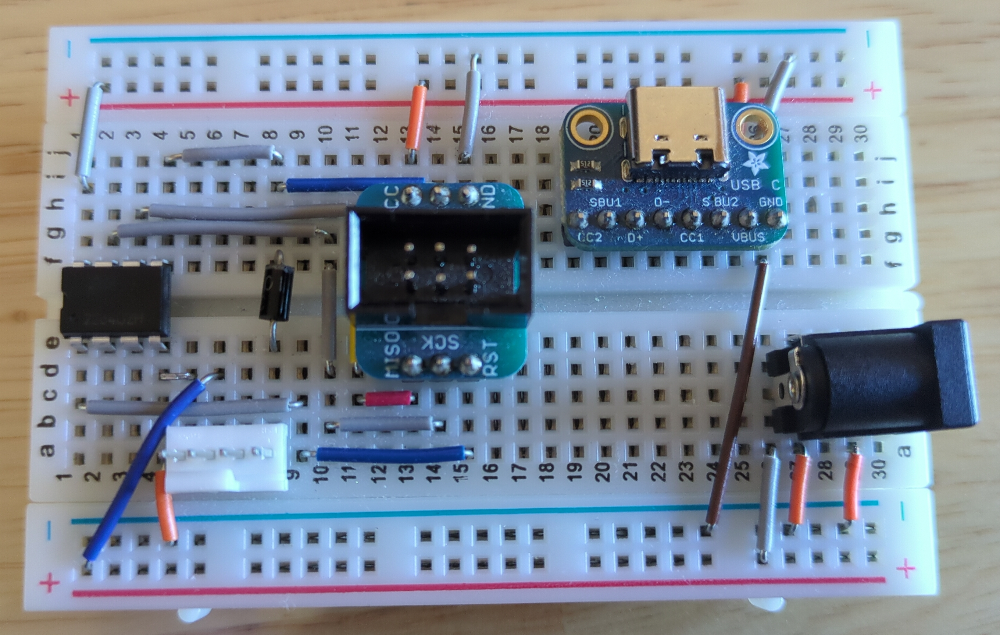

= PWM Fan Controller
Jordan Williams <jordan@jwillikers.com>
:experimental:
:icons: font
ifdef::env-github[]
:tip-caption: :bulb:
:note-caption: :information_source:
:important-caption: :heavy_exclamation_mark:
:caution-caption: :fire:
:warning-caption: :warning:
endif::[]
:Asciidoctor-link: https://asciidoctor.org[Asciidoctor]
:fish: https://fishshell.com/[fish]
:direnv: https://direnv.net/[direnv]
:Git: https://git-scm.com/[Git]
:Linux: https://www.linuxfoundation.org/[Linux]
:nix: https://nixos.org/[Nix]
:nix-direnv: https://github.com/nix-community/nix-direnv[nix-direnv]
:Noctua-NF-P12-redux-1700-PWM-Fan: https://noctua.at/en/nf-p12-redux-1700-pwm[Noctua NF-P12 redux-1700 PWM Fan]
:Rust: https://www.rust-lang.org/[Rust]

PWM fan controller projects written in {Rust} targeting different microcontrollers.
Currently, these are basic examples for setting the {Noctua-NF-P12-redux-1700-PWM-Fan} to a quiescent 40% speed.
Implementations for specific boards can be found in the `boards` directory.

ifdef::env-github[]
++++

  

  

  

++++
endif::[]

ifndef::env-github[]
image::boards/attiny85/pics/attiny85-pwm-fan-controller-protoboard-top.jpg[ATTiny85 PWM Fan Controller Protoboard Top View, align=center]

image::boards/pico/pics/pico-pwm-fan-controller-breadboard-top-1.jpg[Raspberry PI Pico PWM Fan Controller Breadboard Top View 1, align=center]
endif::[]

== Boards

* link:boards/attiny85/README.adoc[ATtiny85]
* link:boards/pico/README.adoc[Raspberry Pi Pico]

== Contributing

Contributions in the form of issues, feedback, and even pull requests are welcome.
Make sure to adhere to the project's link:CODE_OF_CONDUCT.adoc[Code of Conduct].

== Open Source Software

This project is built on the hard work of countless open source contributors.
Several of these projects are enumerated below.

* {Asciidoctor-link}
* {fish}
* {direnv}
* {Git}
* {Linux}
* {Nix}
* {nix-direnv}
* {Rust}

== Code of Conduct

Refer to the project's link:CODE_OF_CONDUCT.adoc[Code of Conduct] for details.

== License

Licensed under either of

* Apache License, Version 2.0 (link:LICENSE-APACHE[LICENSE-APACHE] or http://www.apache.org/licenses/LICENSE-2.0)
* MIT license (link:LICENSE-MIT[LICENSE-MIT] or http://opensource.org/licenses/MIT)

at your option.

© 2022-2024 Jordan Williams

== Authors

mailto:{email}[{author}]
