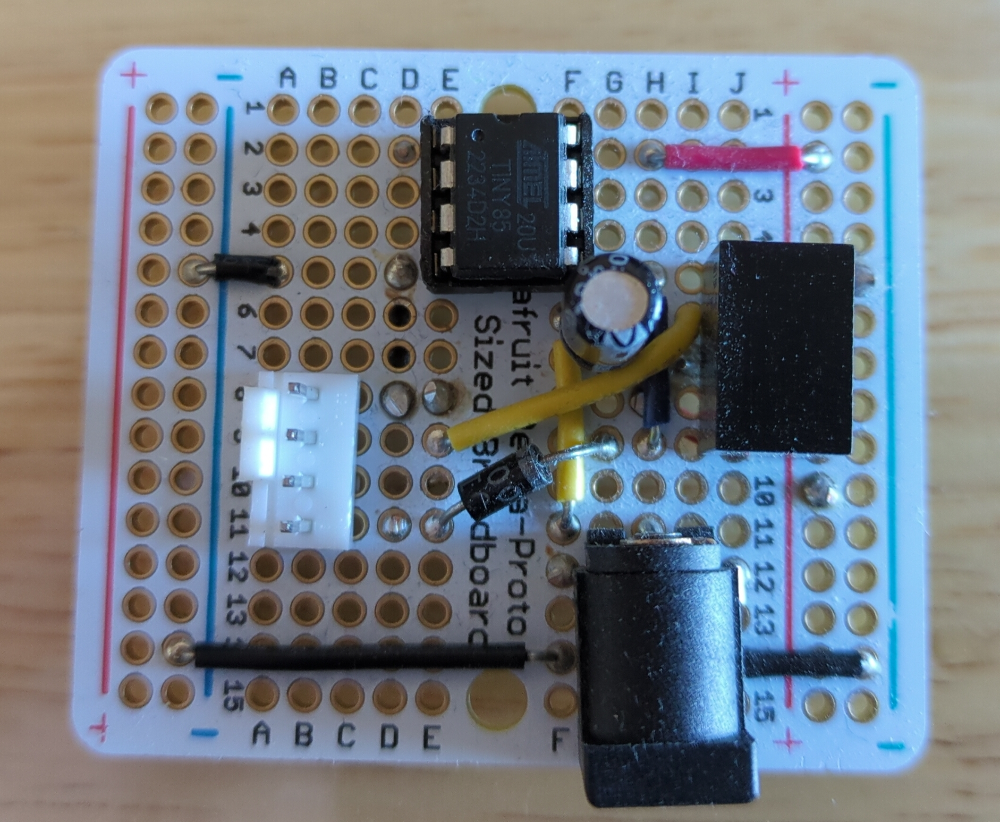
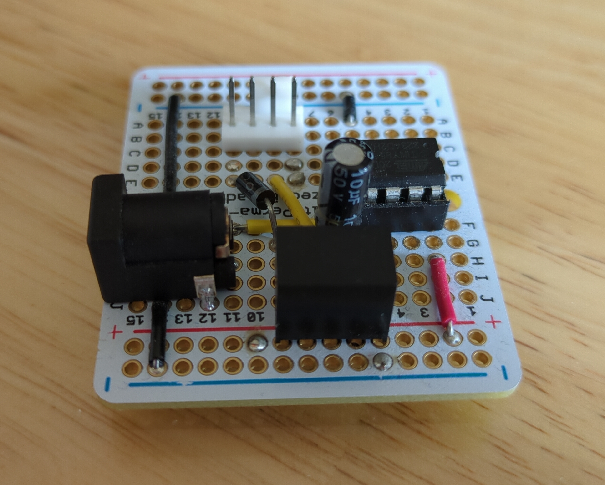
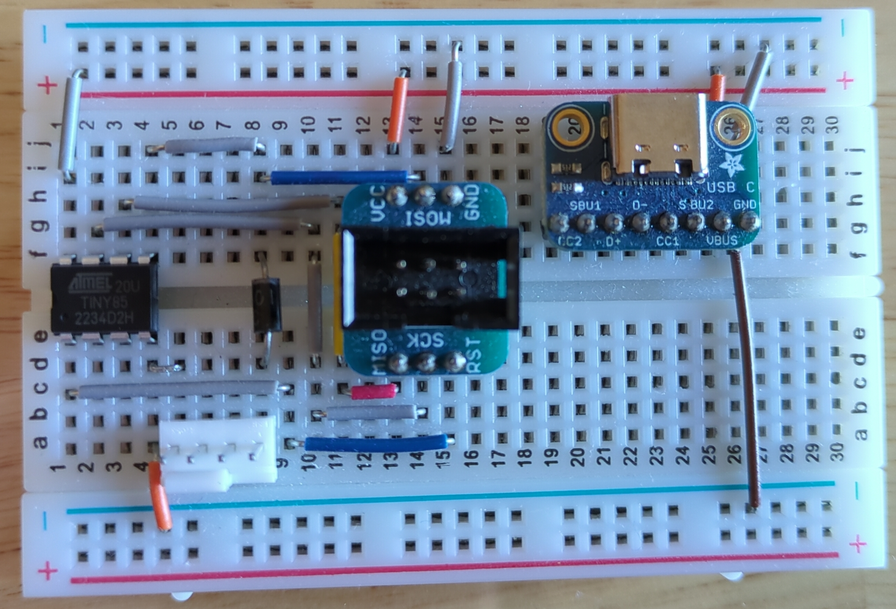
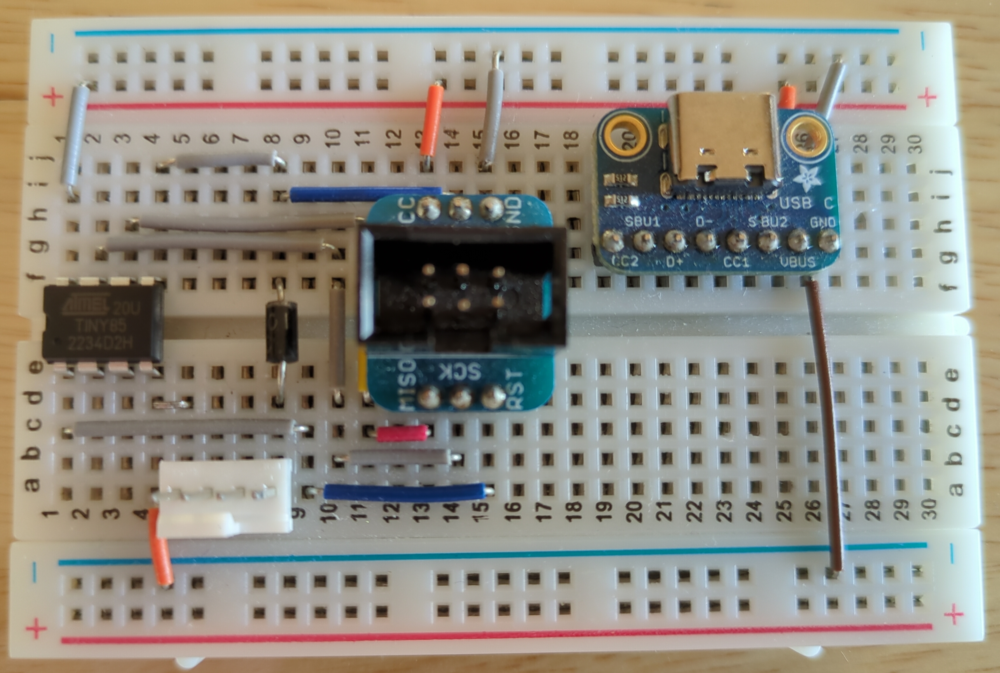
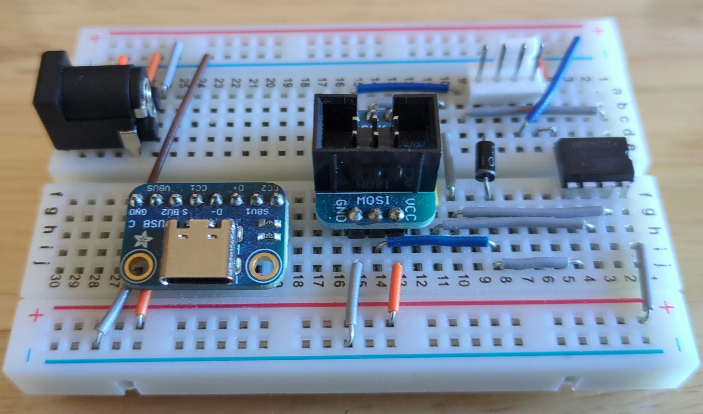
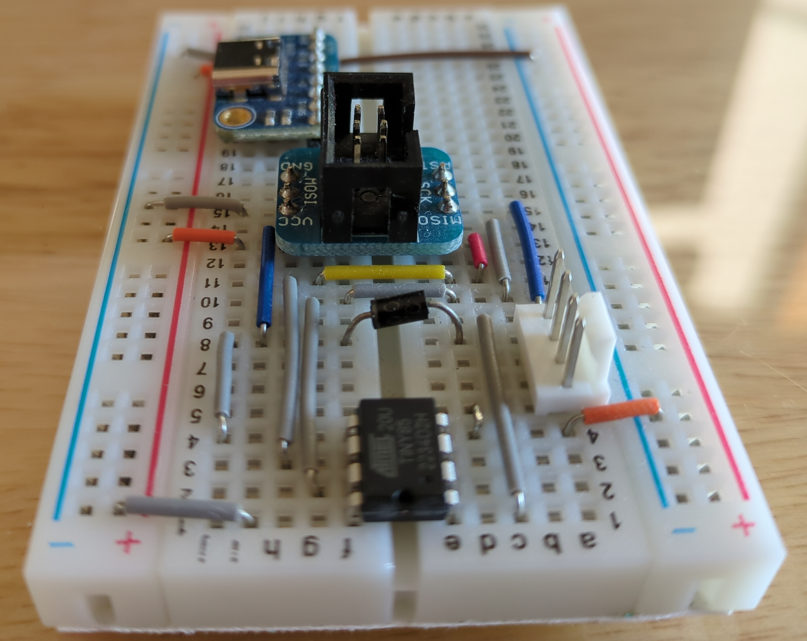

= ATtiny85 PWM Fan Controller
Jordan Williams <jordan@jwillikers.com>
:experimental:
:icons: font
ifdef::env-github[]
:tip-caption: :bulb:
:note-caption: :information_source:
:important-caption: :heavy_exclamation_mark:
:caution-caption: :fire:
:warning-caption: :warning:
endif::[]
:Adafruit-USB-C-Breakout: https://www.adafruit.com/product/4090[Adafruit USB Type C Breakout Board]
:Asciidoctor-link: https://asciidoctor.org[Asciidoctor]
:ATtiny85: https://www.microchip.com/en-us/product/ATtiny85[ATtiny85]
:ATtiny85-20pu: https://www.digikey.com/en/products/detail/microchip-technology/ATTINY85-20PU/735469[ATtiny85 20pu]
:avr-hal: https://github.com/Rahix/avr-hal[avr-hal]
:AVR-Libc: https://www.nongnu.org/avr-libc/[AVR Libc]
:avrdude: https://github.com/avrdudes/avrdude[avrdude]
:cargo-binutils: https://github.com/rust-embedded/cargo-binutils[cargo-binutils]
:fish: https://fishshell.com/[fish]
:Git: https://git-scm.com/[Git]
:Linux: https://www.linuxfoundation.org/[Linux]
:Noctua-NF-P12-redux-1700-PWM-Fan: https://noctua.at/en/nf-p12-redux-1700-pwm[Noctua NF-P12 redux-1700 PWM Fan]
:Python: https://www.python.org/[Python]
:Rouge: https://rouge.jneen.net/[Rouge]
:Ruby: https://www.ruby-lang.org/en/[Ruby]
:Rust: https://www.rust-lang.org/[Rust]
:rustup: https://rustup.rs/[rustup]
:USB-uISP: https://www.tindie.com/products/nsayer/usb-isp/[USB µISP]

PWM fan controller for the {ATtiny85} written in {Rust}.
This fan controller just sets the fan speed to 40% speed to reduce noise from the {Noctua-NF-P12-redux-1700-PWM-Fan}.

ifdef::env-github[]
++++

  

  

  

  

  

  

  

++++
endif::[]

ifndef::env-github[]

image::pics/attiny85-pwm-fan-controller-protoboard-top-angle.jpg[ATTiny85 PWM Fan Controller Protoboard Top Angle View, align=center]

endif::[]

== Hardware

All the hardware components in my particular build are enumerated here.

.Fan Controller Components
* https://www.adafruit.com/product/798[12V DC 1000mA (1A) regulated switching power adapter - UL listed]
* https://www.adafruit.com/product/1465[Adafruit 6-pin AVR ISP Breadboard Adapter Mini Kit]
* {ATtiny85-20pu}
* https://www.adafruit.com/product/368[Female DC Power adapter - 2.1mm jack to screw terminal block]
* https://www.adafruit.com/product/64[Half-size breadboard]
* {Noctua-NF-P12-redux-1700-PWM-Fan}
* https://www.adafruit.com/product/759[Premium Male/Male Jumper Wires - 40 x 3" (75mm)]
* USB-C power supply for the microcontroller
* {Adafruit-USB-C-Breakout}
* {USB-uISP}

Programming will also require a USB-C cable and a computer.

== How it Works

This is a dead-simple PWM fan controller that simply lowers the speed of the {Noctua-NF-P12-redux-1700-PWM-Fan} to a quiescent 40% speed.
The microcontroller simply sets the fan speed and then does nothing.
Since the ATtiny85 is a 5V microcontroller and the Noctua fan uses 5V logic, no logic-level shifter is necessary.
The ATtiny85 draws 2.17 mA of current in this particular configuration.
The fan setup might evolve in the future to take into account temperature sensing and dynamic speed adjustment.

== Circuit

. Gently place the ATtiny85 in the breadboard.
. Connect pin #4 to ground.
. Attach pin #8 to 5V.
. Wire pin #5 on the ATtiny85 to the 4th pin on the Noctua fan header.
This should be the pin opposite the one attached to ground on the fan header.
. Connect the following pins on the ATtiny85 to the associated pins on the 6-pin ISP breakout.
+
[cols="1,1"]
|===
| ATtiny85 pin | ISP Breakout pin

| 1 | RST
| 4 | GND
| 5 | MOSI
| 6 | MISO
| 7 | SCK
| 8 | VCC
|===
. Set the USB µISP's slider to 5V to power the ATtiny85 microcontroller for testing.
. Attach the USB µISP programmer to the 6-pin ISP breakout board.
. Connect the 12V power supply to the 2nd pin in the fan header, the one immediately next to ground.

== Program

. Install {rustup}.
+
[,sh]
----
curl --proto '=https' --tlsv1.2 -sSf https://sh.rustup.rs | sh
----

. Install the AVR GCC toolchain, {AVR-Libc}, and {avrdude}.
+
[,sh]
----
sudo dnf --assumeyes install avr-gcc avr-libc avrdude
----

. Install {cargo-binutils}.
+
[,sh]
----
cargo install cargo-binutils
----

. Install the LLVM tools preview {Rust} component for cargo-binutils.
+
[,sh]
----
rustup component add llvm-tools-preview
----

. Clone the repository.
+
[,sh]
----
git clone https://github.com/jwillikers/pwm-fan-controller.git
----

. Change to the project's directory.
+
[,sh]
----
cd pwm-fan-controller/boards/attiny85
----

. Build the executable.
+
[,sh]
----
cargo build
----

. Convert the executable to the file `pwm.hex` in the Intel hex format.
+
[,sh]
----
cargo objcopy -- -O ihex pwm.hex
----
. Flash the `pwm.hex` file on the ATtiny85 with avrdude.
+
[,sh]
----
avrdude -c USBtiny -B 4 -p attiny85 -U flash:w:pwm.hex:i
----

== Todo

* Add GitHub CI actions.
* Add pre-commit hooks?
* Include pictures in README.
* Add a wiring diagram.
* Describe using the USB-C breakout.
* Measure power consumption.
* Investigate lowering power consumption.

== References

* https://nostarch.com/avr-workshop[AVR Workshop by John Boxall]
* https://ww1.microchip.com/downloads/en/DeviceDoc/Atmel-2586-AVR-8-bit-Microcontroller-ATtiny25-ATtiny45-ATtiny85_Datasheet.pdf[ATtiny85 Datasheet]
* https://en.wikipedia.org/wiki/Computer_fan_control#Pulse-width_modulation[Computer Fan Control: Pulse-width modulation]
* https://github.com/jwillikers/pwm-fan-controller-micropython[PWM Fan Controller Micropython]

.Rust Docs
* https://rahix.github.io/avr-hal/attiny_hal/index.html[attiny_hal]

== Contributing

Contributions in the form of issues, feedback, and even pull requests are welcome.
Make sure to adhere to the project's link:../CODE_OF_CONDUCT.adoc[Code of Conduct].

== Open Source Software

This project is built on the hard work of countless open source contributors.
Several of these projects are enumerated below.

* {Asciidoctor-link}
* {avr-hal}
* {avrdude}
* {AVR-Libc}
* {cargo-binutils}
* {fish}
* {Git}
* {Linux}
* {Rust}

== Code of Conduct

Refer to the project's link:../CODE_OF_CONDUCT.adoc[Code of Conduct] for details.

== License

Licensed under either of

* Apache License, Version 2.0 (link:../LICENSE-APACHE[LICENSE-APACHE] or http://www.apache.org/licenses/LICENSE-2.0)
* MIT license (link:../LICENSE-MIT[LICENSE-MIT] or http://opensource.org/licenses/MIT)

at your option.

© 2022-2024 Jordan Williams

== Authors

mailto:{email}[{author}]
