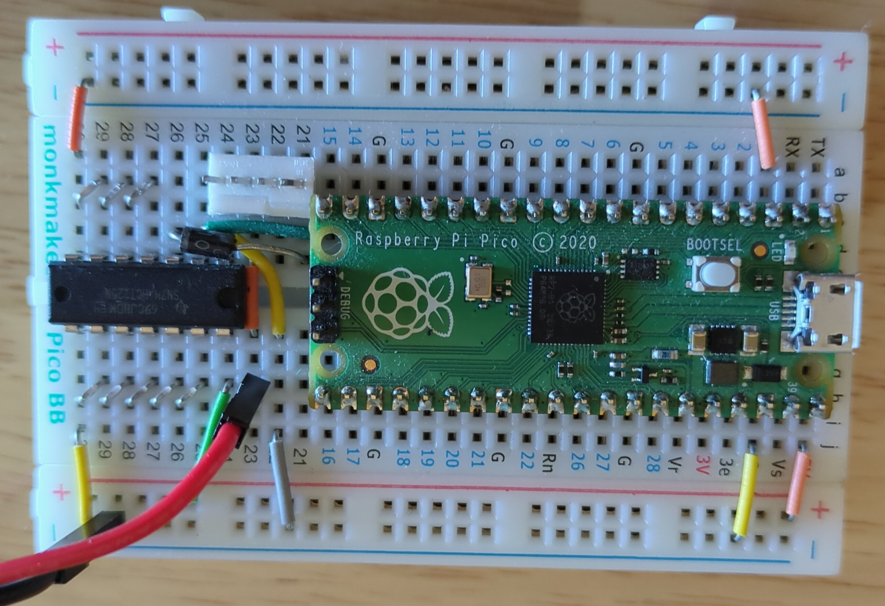
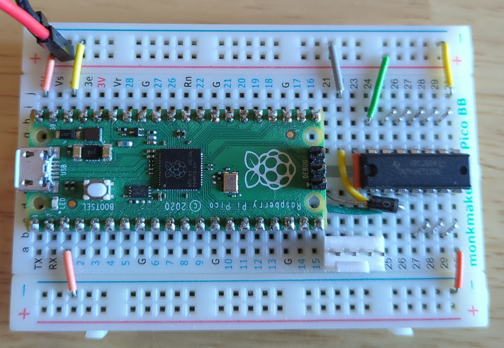
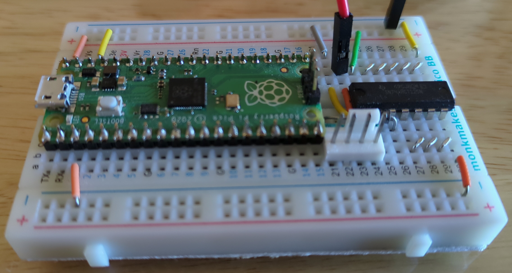
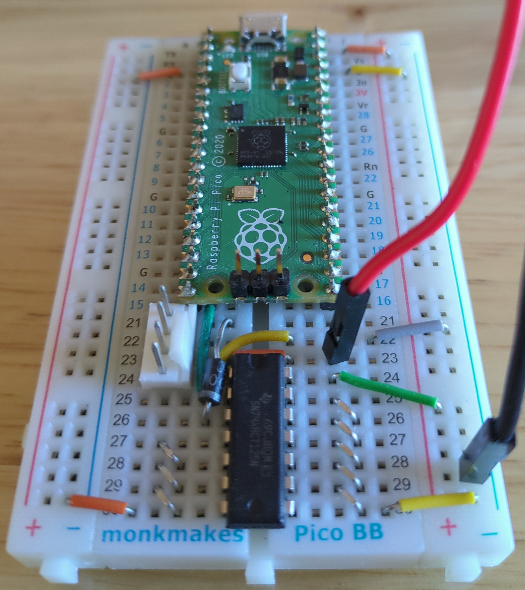
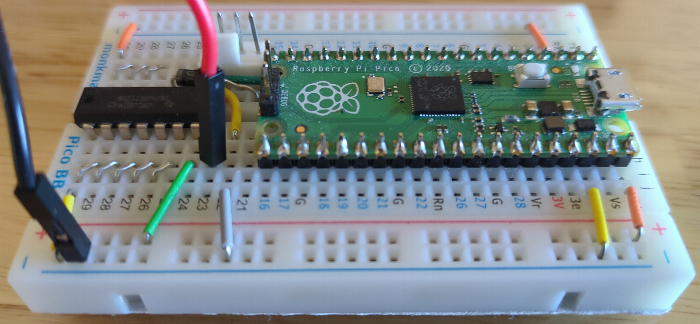

= Raspberry Pi Pico PWM Fan Controller
Jordan Williams <jordan@jwillikers.com>
:experimental:
:icons: font
ifdef::env-github[]
:tip-caption: :bulb:
:note-caption: :information_source:
:important-caption: :heavy_exclamation_mark:
:caution-caption: :fire:
:warning-caption: :warning:
endif::[]
:Asciidoctor-link: https://asciidoctor.org[Asciidoctor]
:cargo-embed: https://github.com/probe-rs/cargo-embed[cargo-embed]
:Dapper-Mime: https://github.com/majbthrd/DapperMime[Dapper Mime]
:elf2uf2-rs: https://github.com/JoNil/elf2uf2-rs[elf2uf2-rs]
:fish: https://fishshell.com/[fish]
:flip-link: https://github.com/knurling-rs/flip-link[flip-link]
:Git: https://git-scm.com/[Git]
:Linux: https://www.linuxfoundation.org/[Linux]
:Noctua-NF-P12-redux-1700-PWM-Fan: https://noctua.at/en/nf-p12-redux-1700-pwm[Noctua NF-P12 redux-1700 PWM Fan]
:Picoprobe-Wiring: https://datasheets.raspberrypi.com/pico/getting-started-with-pico.pdf[Picoprobe Wiring]
:PicoProbe-PCB-kit: https://shop.pimoroni.com/products/picoprobe-pcb-kit?variant=39954095472723[PicoProbe PCB kit]
:probe-run: https://github.com/knurling-rs/probe-run[probe-run]
:Raspberry-Pi-Pico: https://www.raspberrypi.com/products/raspberry-pi-pico/[Raspberry Pi Pico]
:rp-hal: https://github.com/rp-rs/rp-hal[rp-hal]
:Rust: https://www.rust-lang.org/[Rust]
:rustup: https://rustup.rs/[rustup]
:TinyUSB: https://docs.tinyusb.org/en/latest/[TinyUSB]
:UF2: https://github.com/microsoft/uf2[UF2]

PWM fan controller for the {Raspberry-Pi-Pico} written in {Rust}.
This fan controller just sets the fan speed to 40% speed to reduce noise from the {Noctua-NF-P12-redux-1700-PWM-Fan}.

ifdef::env-github[]
++++

  

  

  

  

  

++++
endif::[]

ifndef::env-github[]

endif::[]

== Hardware

All the hardware components in my particular build are enumerated here.

.Fan Controller Components
* https://www.adafruit.com/product/1787[74AHCT125 - Quad Level-Shifter]
* https://www.adafruit.com/product/798[12V DC 1000mA (1A) regulated switching power adapter - UL listed]
* https://www.adafruit.com/product/368[Female DC Power adapter - 2.1mm jack to screw terminal block]
* https://www.adafruit.com/product/64[Half-size breadboard]
* {Noctua-NF-P12-redux-1700-PWM-Fan}
* {Raspberry-Pi-Pico}
* https://www.adafruit.com/product/759[Premium Male/Male Jumper Wires - 40 x 3" (75mm)]
* micro USB power supply for the microcontroller

Programming will require a micro USB cable and a computer.

== How it Works

This is a dead-simple PWM fan controller that simply lowers the speed of the {Noctua-NF-P12-redux-1700-PWM-Fan} to a quiescent 40% speed.
The microcontroller simply sets the fan speed and then does nothing.
The fan setup might evolve in the future to take into account temperature sensing and dynamic speed adjustment.

The 3.3V Raspberry Pi Pico requires a logic-level shifter to boost the PWM signal up to 5V for the fan.
I use the 74AHCT125 to perform the logic-level conversion, using pin #40, `VBUS`, to provide the 5V reference voltage.

The Raspberry Pi Pico draws 2.07 mA of current in this particular configuration.

== Getting Started

. Install {rustup}.
+
[,sh]
----
curl --proto '=https' --tlsv1.2 -sSf https://sh.rustup.rs | sh
----

. Clone the repository.
+
[,sh]
----
git clone https://github.com/jwillikers/pwm-fan-controller.git
----

. Change to the project's directory.
+
[,sh]
----
cd pwm-fan-controller/boards/pico
----

. Install the {Rust} toolchain for the RP2040.
+
[,sh]
----
rustup target add thumbv6m-none-eabi
----

. Install {flip-link}.
+
[,sh]
----
cargo install flip-link
----

. Install {elf2uf2-rs}.
+
[,sh]
----
cargo install elf2uf2-rs
----

. Double check that link:.cargo/config.toml[.cargo/config.toml] has the runner set to `elf2uf2-rs -d`.

. While holding the `BOOT` button, attach the Pico to your computer using the micro-USB port.

. Flash the board using Cargo's `run` subcommand.
+
[,sh]
----
cargo run
----

== Probe

The `UF2` method is handy for programming microcontrollers without requiring any additional hardware.
However, debug probes are quite convenient for flashing and debugging code running on the microcontroller.
There are many debuggers available on the market, but there's something quaint about using a spare Pico as a debugger.
The {PicoProbe-PCB-kit} is a nifty add-on that makes it a bit more convenient to use the Pico as a probe.
The steps here describe how to use a Pico as a debug probe with the {Dapper-Mime} firmware for this project.

. Install the necessary dependencies for {probe-run}.
+
[,sh]
----
sudo dnf install -y libusbx-devel systemd-devel
----

. Install {probe-run}.
+
[,sh]
----
cargo install probe-run
----

. Ensure that link:.cargo/config.toml[.cargo/config.toml] has the runner set to `probe-run --chip RP2040`.

. Install the {TinyUSB} udev rules to be able to access the Dapper Mime Debug probe as a non-root user.
+
[,sh]
----
wget -qLO - https://raw.githubusercontent.com/hathach/tinyusb/master/examples/device/99-tinyusb.rules \
    | sudo tee /etc/udev/rules.d/99-tinyusb.rules
----

. While holding the `BOOTSEL` button on the Raspberry Pi Pico, connect it to the computer.

. Download and install the Dapper Mime firmware to the Raspberry Pi Pico.
+
[,sh]
----
wget -qL --directory-prefix=/run/media/$USER/RPI-RP2 \
  https://github.com/majbthrd/DapperMime/releases/download/20210225/raspberry_pi_pico-DapperMime.uf2
----

. Connect the debug probe Pico to the Pico to flash according to the {Picoprobe-Wiring} documentation.
+
.Picoprobe Wiring
[cols="1,1"]
|===
| Probe | Pico

| GND | GND
| GP2 | SWCLK
| GP3 | SWDIO
| GP4/UART1 TX | GP1/UART0 RX
| GP5/UART1 RX | GP0/UART0 TX
|===

. Now flash the Pico.
+
[,sh]
----
cargo run
----

== Todo

* Document connections with the 1787AHC125.
* Document how to use a debug probe with cargo-embed.
* Document how to use the probe-rs-debugger VSCode extension.
* Measure power efficiency.
* Add GitHub CI actions.
* Add pre-commit hooks?
* Include pictures in README.

== References

* https://www.ti.com/lit/ds/symlink/sn74ahct125.pdf[1787AHC125 Datasheet]
* https://en.wikipedia.org/wiki/Computer_fan_control#Pulse-width_modulation[Computer Fan Control: Pulse-width modulation]
* https://github.com/rp-rs/rp2040-project-template[Project template for rp2040-hal]
* {Picoprobe-Wiring}
* https://github.com/jwillikers/pwm-fan-controller-micropython[PWM Fan Controller Micropython]
* https://www.raspberrypi.com/documentation/microcontrollers/raspberry-pi-pico.html[Raspberry Pi Pico Documentation]
* https://www.raspberrypi.com/documentation/microcontrollers/raspberry-pi-pico.html#pinout-and-design-files[Raspberry Pi Pico Pinout]
* https://datasheets.raspberrypi.com/rp2040/rp2040-datasheet.pdf[RP2040 Datasheet]

.Rust Docs
* https://docs.rs/embedded-hal/latest/embedded_hal/[embedded-hal]
* https://docs.rs/fugit/latest/fugit/[fugit]
* https://docs.rs/rp-pico/0.5.0/rp_pico/[rp-pico]
* https://docs.rs/rp2040-hal/latest/rp2040_hal/[rp2040-hal]

== Contributing

Contributions in the form of issues, feedback, and even pull requests are welcome.
Make sure to adhere to the project's link:../CODE_OF_CONDUCT.adoc[Code of Conduct].

== Open Source Software

This project is built on the hard work of countless open source contributors.
Several of these projects are enumerated below.

* {Asciidoctor-link}
* {Dapper-Mime}
* {elf2uf2-rs}
* {fish}
* {flip-link}
* {Git}
* {Linux}
* {probe-run}
* {rp-hal}
* {Rust}

== Code of Conduct

Refer to the project's link:../CODE_OF_CONDUCT.adoc[Code of Conduct] for details.

== License

Licensed under either of

* Apache License, Version 2.0 (link:../LICENSE-APACHE[LICENSE-APACHE] or http://www.apache.org/licenses/LICENSE-2.0)
* MIT license (link:../LICENSE-MIT[LICENSE-MIT] or http://opensource.org/licenses/MIT)

at your option.

© 2022-2024 Jordan Williams

== Authors

mailto:{email}[{author}]
