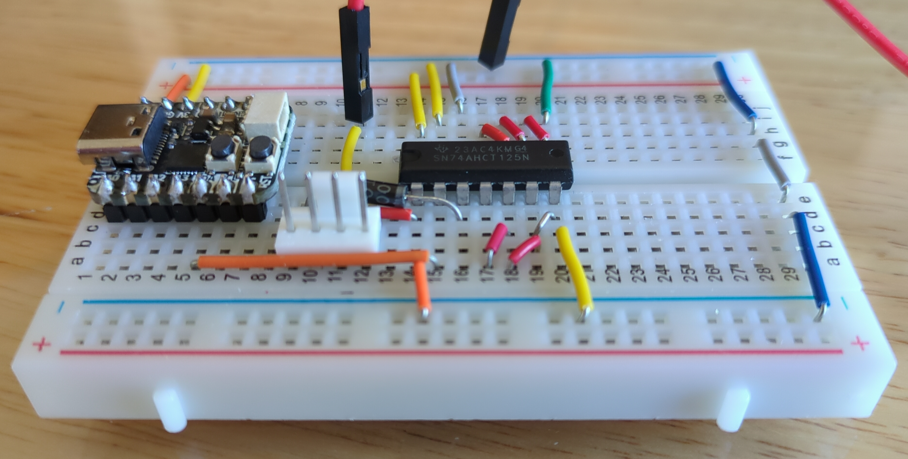

= QT Py CH32V203 PWM Fan Controller
Jordan Williams <jordan@jwillikers.com>
:experimental:
:icons: font
ifdef::env-github[]
:tip-caption: :bulb:
:note-caption: :information_source:
:important-caption: :heavy_exclamation_mark:
:caution-caption: :fire:
:warning-caption: :warning:
endif::[]
:Asciidoctor-link: https://asciidoctor.org[Asciidoctor]
:ch32-hal: https://github.com/ch32-rs/ch32-hal[ch32-hal]
:Git: https://git-scm.com/[Git]
:Noctua-NF-P12-redux-1700-PWM-Fan: https://noctua.at/en/nf-p12-redux-1700-pwm[Noctua NF-P12 redux-1700 PWM Fan]
:QT-Py-CH32V203: https://www.adafruit.com/product/5996[Adafruit QT Py CH32V203]
:Rust: https://www.rust-lang.org/[Rust]
:wchisp: https://ch32-rs.github.io/wchisp/[wchisp]

PWM fan controller for the {QT-Py-CH32V203} RISC-V board written in {Rust}.
This fan controller just sets the fan speed to 40% speed to reduce noise from the {Noctua-NF-P12-redux-1700-PWM-Fan}.

ifdef::env-github[]
++++

  

  

  

  

++++
endif::[]

ifndef::env-github[]
image::pics/qt-py-ch32v203-pwm-fan-controller-breadboard-top-1.jpg[QT Py CH32V203 PWM Fan Controller Breadboard Top View 1, align=center]

image::pics/qt-py-ch32v203-pwm-fan-controller-breadboard-side-2.jpg[QT Py CH32V203 PWM Fan Controller Breadboard Side View 2, align=center]
image::pics/qt-py-ch32v203-pwm-fan-controller-breadboard-side-3.jpg[QT Py CH32V203 PWM Fan Controller Breadboard Side View 3, align=center]
endif::[]

== Hardware

The {QT-Py-CH32V203} uses the CH32V203G8 RISC-V microcontroller.
All the hardware components in my particular build are enumerated here.

.Fan Controller Components
* https://www.adafruit.com/product/798[12V DC 1000mA (1A) regulated switching power adapter - UL listed]
* https://www.digikey.com/en/products/detail/onsemi/1N4001RLG/918017[1N4001 Power Blocking Diode]
* https://www.digikey.com/en/products/detail/molex/0470533000/3262217[4-Pin Male Fan Header]
* https://www.digikey.com/en/products/detail/texas-instruments/SN74AHCT125N/375798[74AHCT125 - Quad Level-Shifter]
* https://www.adafruit.com/product/368[Female DC Power adapter - 2.1mm jack to screw terminal block]
* https://www.adafruit.com/product/64[Half-size breadboard]
* https://www.adafruit.com/product/1311[Hook-up Wire - 22AWG Solid Core]
* USB-C power supply for the microcontroller
* {QT-Py-CH32V203}
* https://www.adafruit.com/product/759[Premium Male/Male Jumper Wires - 40 x 3" (75mm)]

Programming will require a USB-C cable and a computer.
If you don't already have one, you'll probably want a fan, too.
This circuit is meant for a 12V fan.
I use this controller for the {Noctua-NF-P12-redux-1700-PWM-Fan}.

== How it Works

This is a dead-simple PWM fan controller that simply lowers the speed of the {Noctua-NF-P12-redux-1700-PWM-Fan} to a quiescent 40% speed.
The microcontroller simply sets the fan speed and then does nothing.
The fan setup might evolve in the future to take into account temperature sensing and dynamic speed adjustment.

The 3.3V QT Py CH32V203 requires a logic-level shifter to boost the PWM signal up to 5V for the fan.
I use the 74AHCT125 to perform the logic-level conversion, using pin #40, `VBUS`, to provide the 5V reference voltage.

The QT Py CH32V203 draws only 1.11 mA of current in this particular configuration.

== Getting Started

. Change to the board's directory.
+
[,sh]
----
cd pwm-fan-controller/boards/qt-py-ch32v203
----

. Add a udev rule to be able to access the QT Py CH32V203 as a non-root user.
+
./etc/udev/rules.d/60-qt-py-ch32v203.rules
[source]
----
SUBSYSTEM=="usb", ATTRS{idVendor}=="4348", ATTRS{idProduct}=="55e0", TAG+="uaccess"
----

. While holding the `BOOT` button, attach the QT Py CH32V203 to your computer via the USB-C port.

. Flash the board using the `nix run` command with the `qt-py-ch32v203.flash.wchisp` target.
+
[,sh]
----
nix run '../..#qt-py-ch32v203.flash.wchisp'
----

== Todo

* Document connections with the 74AHCT125.

== References

* https://www.ti.com/lit/ds/symlink/sn74ahct125.pdf[SN74AHCT125 Datasheet]
* https://learn.adafruit.com/adafruit-qt-py-ch32v203[Adafruit Learn - QT Py CH32V203]
* https://learn.adafruit.com/assets/132173[Adafruit QT Py CH32V203 Dev Board Pinouts]
* https://www.wch-ic.com/downloads/file/354.html[CH32V203 Datasheet]
* https://en.wikipedia.org/wiki/Computer_fan_control#Pulse-width_modulation[Computer Fan Control: Pulse-width modulation]

.Rust Docs
* https://docs.rs/embedded-hal/latest/embedded_hal/[embedded-hal]
// * https://docs.rs/ch32-hal/latest/[ch32-hal]

== Contributing

Contributions in the form of issues, feedback, and even pull requests are welcome.
Make sure to adhere to the project's link:../CODE_OF_CONDUCT.adoc[Code of Conduct].

== Open Source Software

This project is built on the hard work of countless open source contributors.
Several of these projects are enumerated below.

* {Asciidoctor-link}
* {Git}
* {ch32-hal}
* {Rust}
* {wchisp}

== Code of Conduct

Refer to the project's link:../CODE_OF_CONDUCT.adoc[Code of Conduct] for details.

== License

Licensed under either of

* Apache License, Version 2.0 (link:../LICENSE-APACHE[LICENSE-APACHE] or http://www.apache.org/licenses/LICENSE-2.0)
* MIT license (link:../LICENSE-MIT[LICENSE-MIT] or http://opensource.org/licenses/MIT)

at your option.

© 2024 Jordan Williams

== Authors

mailto:{email}[{author}]
